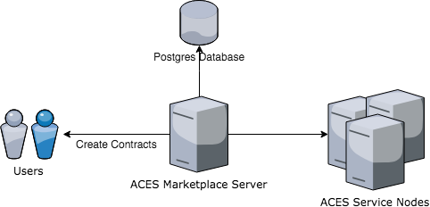

# ACES Marketplace Setup

This guide helps you set up a secure ACES Marketplace server using Ubuntu 16.04.

The ACES Marketplace web application allows the service marketplace provider to
maintain and control a collection of registered ACES Services. Each ACES Marketplace
instance has it's own set of users and service metadata (such as which services are
available, user reviews of services, and references to contracts executed under a 
user). Because of the distributed nature of ACES, an ACES Service node can be registered
to any number of different marketplace instances. 


## Marketplace Server

The ACES Marketplace is a web application that must run on webserver. There are many hosting
optional available including AWS, Linode, Heroku, or running on a private server.

We recommend at least 2GB of memory to run the basic Marketplace node.

This guide is written for Ubuntu 16.04, but the ACES Marketplace application can be 
installed on any server supporting a Java runtime environment.




## Server Security

### SSH Access

To better secure your server, you should disable username and password authentication and only 
allow SSH key authentication for a non-root user.

- https://www.digitalocean.com/community/tutorials/initial-server-setup-with-ubuntu-16-04


### Firewall Setup

```
sudo apt-get install ufw
sudo ufw allow ssh
sudo ufw allow http
sudo ufw enable
```


## Install System Dependencies

```
sudo add-apt-repository ppa:webupd8team/java
sudo apt-get update -y
sudo apt-get install oracle-java8-installer

sudo apt-get install maven
sudo apt-get install pwgen
sudo apt-get instal nginx
```

Install node and npm:

```
sudo apt-get install python-software-properties
curl -sL https://deb.nodesource.com/setup_7.x | sudo -E bash -
sudo apt-get install nodejs
```


## Install Postgres Database

The ACES Marketplace backend application requires a postgresql database to use for marketplace data.

Some cloud providers may have simplified tools for deploying and managing the database instance 
(automated backups and replication), such as Amazon RDS. The ACES Marketplace backend app can be 
configured to connect to any accessible postgresql instance including ones created by such tools.

Manging a postgresql database is outside the scope of this guide, but instructions for installing 
a locally running postgresql instance are given below.


### Generate Password

Generate a database password to be used for the postgres database user:

```
pwgen 20 1
```

Use the generated password for `aces_marketplace_user` below.


### Create Database

```
sudo apt-get install postgresql
sudo -u postgres createuser aces_marketplace_user
sudo -u postgres createdb aces_marketplace
sudo -u postgres psql
psql=# alter user aces_marketplace_user with encrypted password 'change-me';
psql=# grant all privileges on database aces_marketplace to aces_marketplace_user;
```

### Start Postgres

```
sudo service postgresql restart
```

## Get Marketplace Code

```
mkdir /apps
cd /apps
git clone https://github.com/ark-aces/aces-marketplace
```

## Install Marketplace Backend

### Generate Oauth2 secret

Generate a oauth2 secret to identify your frontend application:

```
pwgen 20 1
```

The generated password can be used for your `oauth2.secret` value in the configuration.


### Get ReCaptcha v2 API Key

The ACES Marketplace application uses captcha verification to prevent spamming of account
registrations and secures some forms from brute force attacks.

Follow the instructions at https://developers.google.com/recaptcha/intro to set up a
ReCaptcha v2 account and generate an API `secret` to use in the `application.yml` config file below.

### Get SMTP Credentials

The backend application needs to send emails for password reset and other notifications. 

There are many email providers that can be used including Gmail, SendGrid, MailGun, or hosting
your own postfix server.

We recommend using [MailGun](https://www.mailgun.com) since it is easy to set up and is free up to 10k emails per month.

Use your SMTP credentials supplied by email delivery provider in the `application.yml` configuration below.


### Create Backend Application config

Create a marketplace application config at `/etc/aces-marketplace-backend/application.yml` and add the 
following configuration:

```
server:
  port: 8081

oauth2:
  clientId: "marketplace"
  secret: "change-me"
  tokenValiditySeconds: 86400

spring:
  datasource:
    platform: "postgres"
    url: "jdbc:postgresql://localhost:5432/aces_marketplace"
    username: "aces_marketplace_user"
    password: "change-me"
  jpa:
    hibernate:
      ddl-auto: "validate"

  mail:
    host: "smtp.mailgun.org"
    port: 587
    username: "change-me
    password: "change-me"
    properties:
      mail.smtp.auth: true
      mail.startttls.enable: true

baseUrl: "https://marketplace.example.com"

recaptcha:
  secret: "change-me"

email:
  fromName: "ACES Marketplace"
  fromEmailAddress: "support@example.com"

```

Note: replace any instances of `example.com` with the actual domain name used for your particular 
ACES Marketplace instance.

### Create Backend Application Start script


Create `/etc/systemd/system/aces-marketplace-backend.service` and add the following configuration:

```
[Unit]
Description=Aces Marketplace Backend

[Service]
Restart=always
WorkingDirectory=/app/aces-marketplace/backend
ExecStart=/usr/bin/mvn spring-boot:run -Dspring.config.location=file:/etc/aces-marketplace-backend/application.yml

[Install]
WantedBy=multi-user.target
```

Enable the systemd job to start up on system boot:

```
sudo systemctl daemon-reload
sudo systemctl enable aces-marketplace-backend 
```

Start the backend application:

```
sudo service aces-marketplace-backend start
```

The application outputs logs to `/var/log/syslog` including any start up errors that might occur
due to misconfiguration.


## Install Marketplace Frontend

### ReCaptcha Site Key

Edit `/apps/aces-marketplace/frontend/src/environments/environment.prod.ts` and change
the `recaptchaSiteKey` value to the site key for your ReCaptcha account. The `recaptchaSiteKey`
is different from the recaptcha `secret` used on the backend.


### Build Frontend

Use npm to build and package the angular frontend application:

```
cd /apps/aces-marketplace/frontend
npm install
npm run-script build --prod --build-optimizer
```

### Install Frontend

Copy the generated static frontend application files into `/var/www/aces-marketplace/` that
will be served up by your nginx configuration in a later step.

```
mkdir /var/www/aces-marketplace/
cp -R /app/aces-marketplace/frontend/dist/** /var/www/aces-marketplace/
```


## Install SSL Certificates

We recommend using LetsEncrypt for free SSL certificates. 

- https://letsencrypt.org/


### Install Dependencies

```
sudo apt-get install software-properties-common
sudo add-apt-repository ppa:certbot/certbot
sudo apt-get update
sudo apt-get install certbot
```

### Generating Certificates

Set `DOMAIN_NAME` below to a domain name registered to your server IP address. 
LetsEncrypt will start a local webserver to validate the registered domain name
points to the server IP.

First temporarily disable nginx server to allow LetsEncrypt to validate your domain and issue
the SSL certs.  

```
sudo service nginx stop
```

```
export DOMAIN_NAME=marketplace.example.com
certbot certonly -d $DOMAIN_NAME --force-renewal
```

In this example we show `marketplace.example.com`, but you should replace that with your actual
marketplace instance domain.

## Setup Nginx

Edit `/etc/nginx/sites-enabled/default` and add the following basic setup. Replace 
`marketplace.example.com` with your actual marketplace domain name.

```
server {
    listen 80;
    root /var/www/aces-marketplace/;
    server_name marketplace.example.com;
    
    # Serve ACES Marketplace frontend app directly
    location / {
        try_files $uri $uri/ /index.html;
    }
    
    # Pass api requests to the ACES Marketplace backend app
    location /api/ {
        proxy_pass http://127.0.0.1:8081/;
    }

    listen 443 ssl; # managed by Certbot
    ssl_certificate /etc/letsencrypt/live/marketplace.example.com/fullchain.pem; # managed by Certbot
    ssl_certificate_key /etc/letsencrypt/live/marketplace.example.com/privkey.pem; # managed by Certbot

    if ($scheme != "https") {
        return 301 https://$host$request_uri;
    }
}
```

```
sudo service nginx restart
```

## Testing Setup

With this setup, the frontend application is served at `https://marketplace.example.com` (replace domain name with
the one used in your setup). 

The backend API is served at `https://marketplace.example.com/api/`.

You can follow the instructions in [ACES Marketplace Guide](aces-marketplace.md) for 
posting services to your marketplace instance using the API.